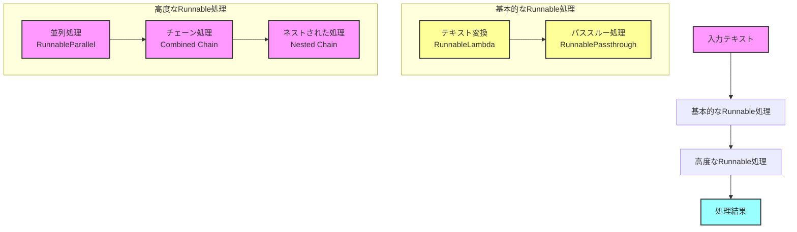

<p align="center">
  
  <h1 align="center">🔗 langchain-sandbox v0.1.0</h1>
</p>

<p align="center">
  <a href="https://github.com/Sunwood-ai-labs/langchain-sandbox">
    
  </a>
  <a href="https://github.com/Sunwood-ai-labs/langchain-sandbox/blob/main/LICENSE">
    
  </a>
  <a href="https://github.com/Sunwood-ai-labs/langchain-sandbox/stargazers">
    
  </a>
  
</p>

<p align="center">
  
  
  
  
</p>

## 🚀 プロジェクト概要

langchain-sandboxは、LangChainの様々な機能、特にRunnableを活用したAI処理システムの実装例を提供するサンドボックスプロジェクトです。このリポジトリは、LangChainを使用した実践的な開発パターンとベストプラクティスを学ぶための教育リソースとして機能します。  v0.1.0リリースでは、README.md の更新、プロジェクトロゴ画像の追加(`docs/langchain-sandbox.png`)、そしてログ出力をより見やすくカラフルにする`logger_setup.py`の作成を行いました。

## 🌟 目的

- 📚 LangChainのRunnableシステムの実践的な使用例の提供
- 🔄 段階的に複雑さを増す実装パターンの紹介
- 🎓 実用的なAIアプリケーション開発の基礎の確立

## 📂 プロジェクト構造

```plaintext
├─ sandbox/
│  ├─ runnable/                  # Langchain Runnable実装
│  │  ├─ advanced/              # 高度な使用例
│  │  │  ├─ 01_basic_parallel.py    # 基本的な並列処理
│  │  │  ├─ 02_transform_chain.py   # 変換チェーン
│  │  │  ├─ 03_complex_parallel.py  # 複雑な並列処理
│  │  ├─ basic/                 # 基本的な使用例
│  │  │  ├─ 01_simple_transform.py  # シンプルな変換
│  │  │  ├─ 02_passthrough_chain.py # パススルーチェーン
│  │  │  ├─ 03_combined_chain.py    # 結合チェーン
│  │  │  ├─ 04_nested_chain.py      # ネストされたチェーン
│  │  │  ├─ logger_setup.py         # ロギング設定
├─ app.py                        # Streamlitアプリケーション
├─ issue_creator.log              # (空ファイル)
├─ requirements.txt              # 依存関係
├─ README.md                      # このファイル
```

## ✨ 主な機能

### 🔰 基本的なRunnable機能:
   - シンプルな変換処理 (`sandbox/runnable/basic/01_simple_transform.py`)
   - パススルーチェーン (`sandbox/runnable/basic/02_passthrough_chain.py`)
   - 結合チェーン (`sandbox/runnable/basic/03_combined_chain.py`)
   - ネストされたチェーン (`sandbox/runnable/basic/04_nested_chain.py`)

### 🚀 高度なRunnable機能:
   - 基本的な並列処理 (`sandbox/runnable/advanced/01_basic_parallel.py`)
   - カスタム変換機能を含むチェーン (`sandbox/runnable/advanced/02_transform_chain.py`)
   - 複雑な並列処理 (`sandbox/runnable/advanced/03_complex_parallel.py`)

### 🛠️ 補助機能:
   - 詳細なロギングシステム (`sandbox/runnable/basic/logger_setup.py`)
   - Streamlitベースのデモインターフェース (`app.py`)


## 🔧 インストール手順

1. リポジトリのクローン:
   ```bash
   git clone https://github.com/Sunwood-ai-labs/langchain-sandbox.git
   cd langchain-sandbox
   ```

2. 仮想環境の作成と有効化:
   ```bash
   # uvを使用する場合:
   uv venv
   .venv\Scripts\activate    # Windows
   source .venv/bin/activate  # Linux/macOS

   # pythonを使用する場合:
   python -m venv .venv
   .venv\Scripts\activate    # Windows
   source .venv/bin/activate  # Linux/macOS
   ```

3. 依存関係のインストール:
   ```bash
   # uvを使用する場合:
   uv pip install -r requirements.txt

   # pipを使用する場合:
   pip install -r requirements.txt
   ```

### 実行方法

Streamlit アプリケーションを実行するには、仮想環境を有効にした状態で以下のコマンドを実行します。

```bash
streamlit run app.py
```

個々のPythonファイルを実行するには、仮想環境を有効にした状態で、該当するファイルへのパスを指定して実行します。例:

```bash
python sandbox/runnable/basic/01_simple_transform.py
```


## 🔄 処理フロー例



## 📚 学習リソース

各実装例には詳細なドキュメントとコメントが含まれており、以下の概念を学ぶことができます：

- RunnableLambdaの基本的な使用方法
- チェーンの構築と組み合わせ
- 並列処理の実装
- エラーハンドリングとロギング
- 複雑なチェーンの設計パターン

## 🤝 コントリビューション

プルリクエストや課題の報告は大歓迎です！以下の手順で貢献できます：

1. このリポジトリをフォーク
2. 新しいブランチを作成 (`git checkout -b feature/amazing-feature`)
3. 変更をコミット (`git commit -m 'Add amazing feature'`)
4. ブランチをプッシュ (`git push origin feature/amazing-feature`)
5. プルリクエストを作成

## 📄 ライセンス

このプロジェクトはMITライセンスの下で公開されています。詳細は[LICENSE](LICENSE)ファイルを参照してください。

---

<p align="center">
  Built with ❤️ using <a href="https://github.com/langchain-ai/langchain">LangChain</a>
</p>