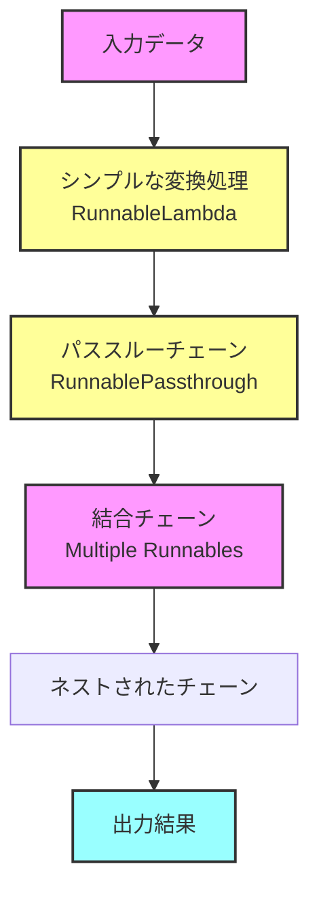
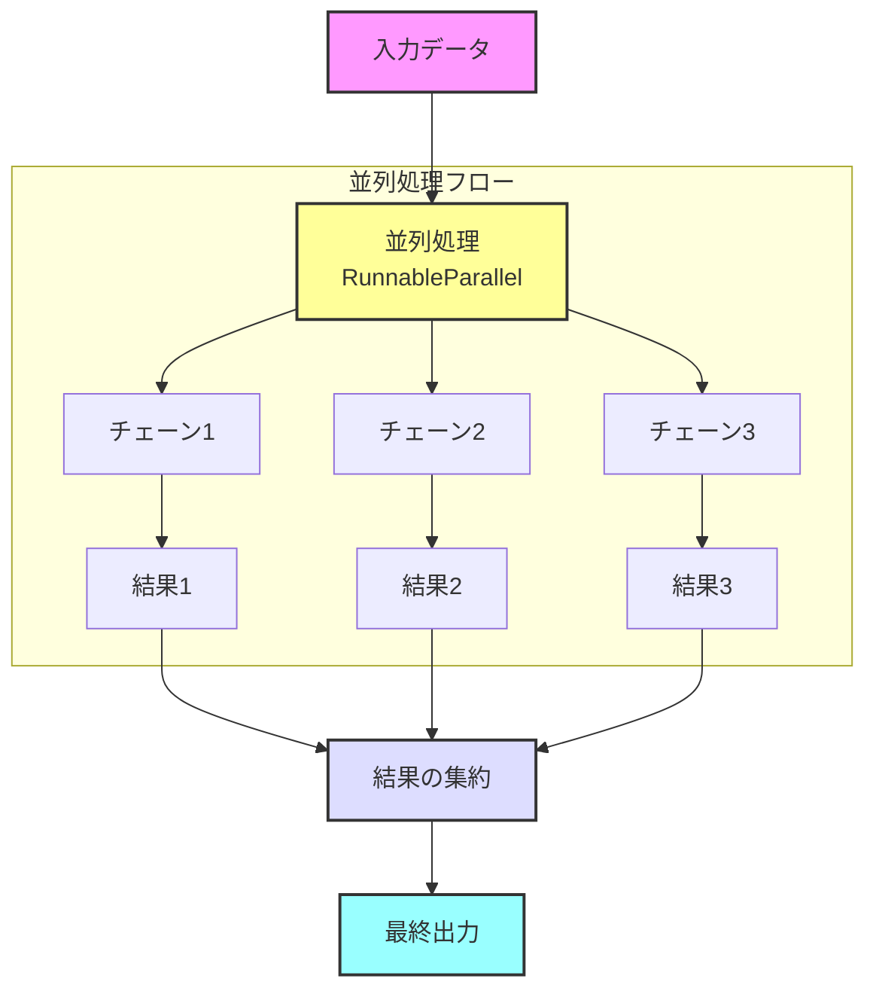

# 🔗 langchain-sandbox

<p align="center">
  
  <h1 align="center">🔗 langchain-sandbox</h1>
</p>

<p align="center">
  <a href="https://github.com/Sunwood-ai-labs/langchain-sandbox">
    
  </a>
  <a href="https://github.com/Sunwood-ai-labs/langchain-sandbox/blob/main/LICENSE">
    
  </a>
  <a href="https://github.com/Sunwood-ai-labs/langchain-sandbox/stargazers">
    
  </a>
  
</p>

<p align="center">
  
  
  
  
</p>

## 🎯 プロジェクト概要

langchain-sandboxは、LangChainの様々な機能、特にRunnableを活用したAI処理システムの実装例を提供するサンドボックスプロジェクトです。基本的な使用例から高度な実装まで、段階的に学習できる教育リソースとして機能します。

## 🌟 特徴と目的

- 📚 段階的な学習が可能なチュートリアル構成
- 🔄 基本から応用までの実践的な実装パターン
- 🎓 詳細な説明とベストプラクティスの提供
- 🛠️ 再利用可能なコンポーネント設計
- 📊 視覚的な処理フローの説明

## 📂 プロジェクト構造

```plaintext
├─ sandbox/
│  ├─ runnable/                      # Langchain Runnable実装
│  │  ├─ advanced/                   # 高度な使用例
│  │  │  ├─ 01_basic_parallel.py        # 基本的な並列処理
│  │  │  ├─ 02_enhanced_parallel.py     # 拡張された並列チェーン
│  │  │  ├─ logger_setup.py             # ロギング設定
│  │  │  └─ README.md                   # 高度な実装の説明
│  │  │
│  │  ├─ basic/                     # 基本的な使用例
│  │  │  ├─ 01_simple_transform.py     # シンプルな変換処理
│  │  │  ├─ 02_passthrough_chain.py    # パススルーチェーン
│  │  │  ├─ 03_combined_chain.py       # 結合チェーン
│  │  │  ├─ 04_nested_chain.py         # ネストされたチェーン
│  │  │  ├─ logger_setup.py            # ロギング設定
│  │  │  └─ README.md                  # 基本実装の説明
│  │  │
├─ app.py                           # Streamlitアプリケーション
└─ requirements.txt                 # 依存関係
```

## 🚀 実装された機能

### 🔰 基本的なRunnable機能



1. **シンプルな変換処理** (`01_simple_transform.py`)
   - RunnableLambdaの基本的な使用
   - テキスト分析の実装
   - エラーハンドリングの基礎

2. **パススルーチェーン** (`02_passthrough_chain.py`)
   - RunnablePassthroughの活用
   - データの受け渡し制御
   - ログ出力による可視化

3. **結合チェーン** (`03_combined_chain.py`)
   - 複数のRunnableの組み合わせ
   - 段階的な処理の実装
   - フロー制御の最適化

4. **ネストされたチェーン** (`04_nested_chain.py`)
   - 複雑なチェーン構造の構築
   - 中間結果の活用方法
   - 高度なエラーハンドリング

### 🚀 高度なRunnable機能



1. **基本的な並列処理** (`01_basic_parallel.py`)
   - RunnableParallelの活用
   - 並列処理の効率化
   - デバッグ用コールバック

2. **拡張並列チェーン** (`02_enhanced_parallel_chains.py`)
   - 複雑な並列処理の実装
   - 結果の選択的利用
   - 高度なチェーン管理

## 🔧 セットアップと実行

### 環境のセットアップ

1. リポジトリのクローン:
   ```bash
   git clone https://github.com/Sunwood-ai-labs/langchain-sandbox.git
   cd langchain-sandbox
   ```

2. 仮想環境の作成と有効化:
   ```bash
   # uvを使用する場合:
   uv venv
   .venv\Scripts\activate    # Windows
   source .venv/bin/activate  # Linux/macOS

   # pythonを使用する場合:
   python -m venv .venv
   .venv\Scripts\activate    # Windows
   source .venv/bin/activate  # Linux/macOS
   ```

3. 依存関係のインストール:
   ```bash
   # uvを使用する場合:
   uv pip install -r requirements.txt

   # pipを使用する場合:
   pip install -r requirements.txt
   ```

### 実行例

#### 基本的な例の実行:
```bash
# シンプルな変換の例
python sandbox/runnable/basic/01_simple_transform.py

# パススルーチェーンの例
python sandbox/runnable/basic/02_passthrough_chain.py
```

#### 高度な例の実行:
```bash
# 並列処理の例
python sandbox/runnable/advanced/01_basic_parallel.py

# 拡張並列チェーンの例
python sandbox/runnable/advanced/02_enhanced_parallel_chains.py
```

## 📚 主要コンセプト

### 基本的なRunnableパターン
```python
# シンプルな変換
transform = RunnableLambda(text_analyzer)

# パススルーチェーン
chain = RunnableLambda(transform) | prompt | model | parser

# 結合チェーン
chain = (
    RunnableLambda(step1)
    | RunnableLambda(step2)
    | final_step
)
```

### 高度なRunnableパターン
```python
# 並列処理
chain = RunnableParallel(
    description=description_prompt | model | parser,
    analysis=analysis_prompt | model | parser
)

# デバッグコールバック
class DebugCallbackHandler(BaseCallbackHandler):
    def on_llm_start(self, serialized, prompts, **kwargs):
        logger.debug(f"LLM開始: {prompts}")
```

## 🎓 学習リソース

各実装には詳細な説明とコメントが含まれており、以下の概念を学ぶことができます：

- Runnableの基本的な使用方法
- チェーンの構築と組み合わせ方
- 並列処理の実装テクニック
- エラーハンドリングとデバッグ手法
- パフォーマンスの最適化
- コードの構造化と再利用性

## 🤝 コントリビューション

プルリクエストや課題の報告は大歓迎です！以下の手順で貢献できます：

1. このリポジトリをフォーク
2. 新しいブランチを作成 (`git checkout -b feature/amazing-feature`)
3. 変更をコミット (`git commit -m 'Add amazing feature'`)
4. ブランチをプッシュ (`git push origin feature/amazing-feature`)
5. プルリクエストを作成

## 📄 ライセンス

このプロジェクトはMITライセンスの下で公開されています。詳細は[LICENSE](LICENSE)ファイルを参照してください。

---

<p align="center">
  Built with ❤️ using <a href="https://github.com/langchain-ai/langchain">LangChain</a>
</p>
