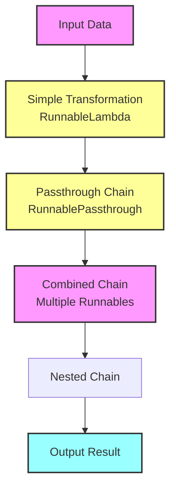
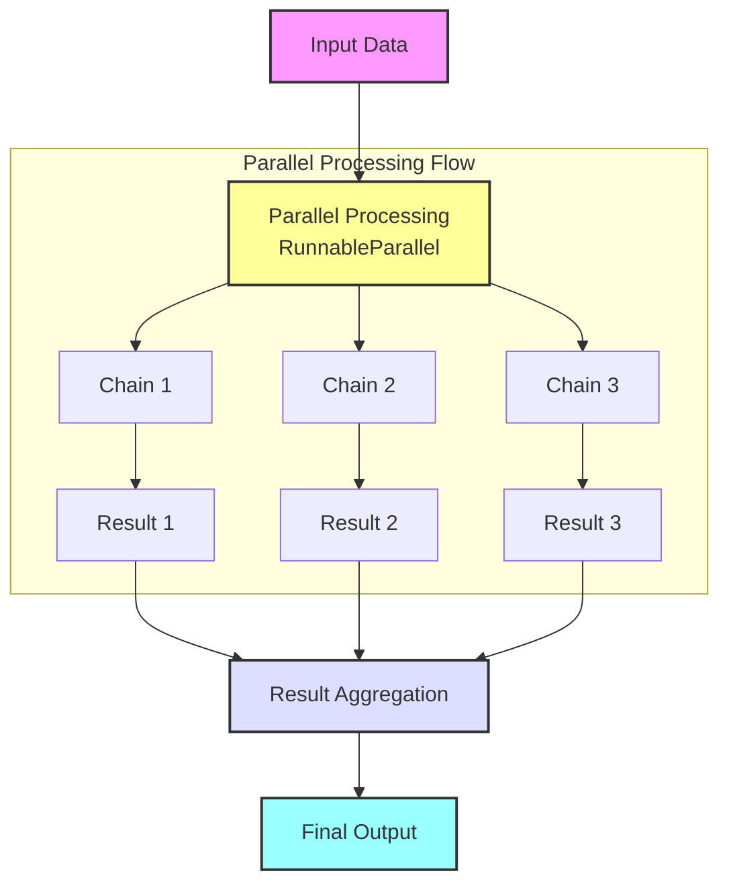

# 🔗 langchain-sandbox

<p align="center">
  
  <h1 align="center">🔗 langchain-sandbox</h1>
</p>

<p align="center">
  <a href="https://github.com/Sunwood-ai-labs/langchain-sandbox">
    
  </a>
  <a href="https://github.com/Sunwood-ai-labs/langchain-sandbox/blob/main/LICENSE">
    
  </a>
  <a href="https://github.com/Sunwood-ai-labs/langchain-sandbox/stargazers">
    
  </a>
  
</p>

<p align="center">
  
  
  
  
</p>

## 🎯 Project Overview

langchain-sandbox is a sandbox project providing implementation examples of various LangChain features, particularly those utilizing Runnables, for AI processing systems.  It serves as an educational resource enabling gradual learning, from basic usage to advanced implementations.

## 🌟 Features and Purpose

- 📚 Tutorial structure allowing for step-by-step learning
- 🔄 Practical implementation patterns from basic to advanced levels
- 🎓 Detailed explanations and best practices
- 🛠️ Reusable component design
- 📊 Visual explanations of processing flows

## 📂 Project Structure

```plaintext
├─ sandbox/
│  ├─ runnable/                      # Langchain Runnable implementations
│  │  ├─ advanced/                   # Advanced usage examples
│  │  │  ├─ 01_basic_parallel.py        # Basic parallel processing
│  │  │  ├─ 02_enhanced_parallel.py     # Enhanced parallel chain
│  │  │  ├─ logger_setup.py             # Logging configuration
│  │  │  └─ README.md                   # Explanation of advanced implementations
│  │  │
│  │  ├─ basic/                     # Basic usage examples
│  │  │  ├─ 01_simple_transform.py     # Simple transformation process
│  │  │  ├─ 02_passthrough_chain.py    # Passthrough chain
│  │  │  ├─ 03_combined_chain.py       # Combined chain
│  │  │  ├─ 04_nested_chain.py         # Nested chain
│  │  │  ├─ logger_setup.py            # Logging configuration
│  │  │  └─ README.md                  # Explanation of basic implementations
│  │  │
├─ app.py                           # Streamlit application
└─ requirements.txt                 # Dependencies
```

## 🚀 Implemented Features

### 🔰 Basic Runnable Features



1. **Simple Transformation** (`01_simple_transform.py`)
   - Basic usage of RunnableLambda
   - Implementation of text analysis
   - Basic error handling

2. **Passthrough Chain** (`02_passthrough_chain.py`)
   - Utilization of RunnablePassthrough
   - Data transfer control
   - Visualization through log output

3. **Combined Chain** (`03_combined_chain.py`)
   - Combination of multiple Runnables
   - Implementation of step-by-step processing
   - Optimization of flow control

4. **Nested Chain** (`04_nested_chain.py`)
   - Construction of complex chain structures
   - How to utilize intermediate results
   - Advanced error handling

### 🚀 Advanced Runnable Features



1. **Basic Parallel Processing** (`01_basic_parallel.py`)
   - Utilization of RunnableParallel
   - Efficiency improvement of parallel processing
   - Debug callback

2. **Enhanced Parallel Chains** (`02_enhanced_parallel_chains.py`)
   - Implementation of complex parallel processing
   - Selective use of results
   - Advanced chain management

## 🔧 Setup and Execution

### Environment Setup

1. Clone the repository:
   ```bash
   git clone https://github.com/Sunwood-ai-labs/langchain-sandbox.git
   cd langchain-sandbox
   ```

2. Create and activate a virtual environment:
   ```bash
   # Using uv:
   uv venv
   .venv\Scripts\activate    # Windows
   source .venv/bin/activate  # Linux/macOS

   # Using python:
   python -m venv .venv
   .venv\Scripts\activate    # Windows
   source .venv/bin/activate  # Linux/macOS
   ```

3. Install dependencies:
   ```bash
   # Using uv:
   uv pip install -r requirements.txt

   # Using pip:
   pip install -r requirements.txt
   ```

### Execution Examples

#### Running Basic Examples:
```bash
# Simple transformation example
python sandbox/runnable/basic/01_simple_transform.py

# Passthrough chain example
python sandbox/runnable/basic/02_passthrough_chain.py
```

#### Running Advanced Examples:
```bash
# Parallel processing example
python sandbox/runnable/advanced/01_basic_parallel.py

# Enhanced parallel chain example
python sandbox/runnable/advanced/02_enhanced_parallel_chains.py
```

## 📚 Key Concepts

### Basic Runnable Patterns
```python
# Simple transformation
transform = RunnableLambda(text_analyzer)

# Passthrough chain
chain = RunnableLambda(transform) | prompt | model | parser

# Combined chain
chain = (
    RunnableLambda(step1)
    | RunnableLambda(step2)
    | final_step
)
```

### Advanced Runnable Patterns
```python
# Parallel processing
chain = RunnableParallel(
    description=description_prompt | model | parser,
    analysis=analysis_prompt | model | parser
)

# Debug callback
class DebugCallbackHandler(BaseCallbackHandler):
    def on_llm_start(self, serialized, prompts, **kwargs):
        logger.debug(f"LLM start: {prompts}")
```

## 🎓 Learning Resources

Each implementation includes detailed explanations and comments, allowing you to learn the following concepts:

- Basic usage of Runnables
- Chain construction and combination
- Implementation techniques for parallel processing
- Error handling and debugging techniques
- Performance optimization
- Code structuring and reusability

## 🤝 Contributions

Pull requests and issue reports are welcome! You can contribute by following these steps:

1. Fork this repository
2. Create a new branch (`git checkout -b feature/amazing-feature`)
3. Commit your changes (`git commit -m 'Add amazing feature'`)
4. Push the branch (`git push origin feature/amazing-feature`)
5. Create a pull request

## 📄 License

This project is licensed under the MIT License. See the [LICENSE](LICENSE) file for details.

---

<p align="center">
  Built with ❤️ using <a href="https://github.com/langchain-ai/langchain">LangChain</a>
</p>