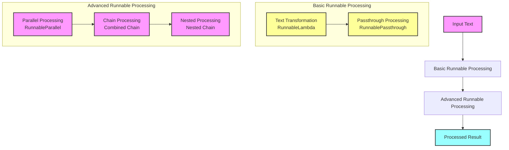

<p align="center">
  
  <h1 align="center">🔗 langchain-sandbox v0.1.0</h1>
</p>

<p align="center">
  <a href="https://github.com/Sunwood-ai-labs/langchain-sandbox">
    
  </a>
  <a href="https://github.com/Sunwood-ai-labs/langchain-sandbox/blob/main/LICENSE">
    
  </a>
  <a href="https://github.com/Sunwood-ai-labs/langchain-sandbox/stargazers">
    
  </a>
  
</p>

<p align="center">
  
  
  
  
</p>

## 🚀 Project Overview

langchain-sandbox is a sandbox project providing implementation examples of various LangChain functionalities, particularly those utilizing Runnables for AI processing systems. This repository serves as an educational resource for learning practical development patterns and best practices using LangChain.  The v0.1.0 release includes an updated README.md, the addition of a project logo image (`docs/langchain-sandbox.png`), and the creation of `logger_setup.py` for improved and more colorful log output.

## 🌟 Objectives

- 📚 Provide practical usage examples of LangChain's Runnable system.
- 🔄 Introduce implementation patterns with progressively increasing complexity.
- 🎓 Establish a foundation for practical AI application development.

## 📂 Project Structure

```plaintext
├─ sandbox/
│  ├─ runnable/                  # Langchain Runnable implementations
│  │  ├─ advanced/              # Advanced usage examples
│  │  │  ├─ 01_basic_parallel.py    # Basic parallel processing
│  │  │  ├─ 02_transform_chain.py   # Transform chain
│  │  │  ├─ 03_complex_parallel.py  # Complex parallel processing
│  │  ├─ basic/                 # Basic usage examples
│  │  │  ├─ 01_simple_transform.py  # Simple transformation
│  │  │  ├─ 02_passthrough_chain.py # Passthrough chain
│  │  │  ├─ 03_combined_chain.py    # Combined chain
│  │  │  ├─ 04_nested_chain.py      # Nested chain
│  │  │  ├─ logger_setup.py         # Logging configuration
├─ app.py                        # Streamlit application
├─ issue_creator.log              # (Empty file)
├─ requirements.txt              # Dependencies
├─ README.md                      # This file
```

## ✨ Main Features

### 🔰 Basic Runnable Features:
   - Simple transformation processing (`sandbox/runnable/basic/01_simple_transform.py`)
   - Passthrough chain (`sandbox/runnable/basic/02_passthrough_chain.py`)
   - Combined chain (`sandbox/runnable/basic/03_combined_chain.py`)
   - Nested chain (`sandbox/runnable/basic/04_nested_chain.py`)

### 🚀 Advanced Runnable Features:
   - Basic parallel processing (`sandbox/runnable/advanced/01_basic_parallel.py`)
   - Chain with custom transformation functionality (`sandbox/runnable/advanced/02_transform_chain.py`)
   - Complex parallel processing (`sandbox/runnable/advanced/03_complex_parallel.py`)

### 🛠️ Supporting Features:
   - Detailed logging system (`sandbox/runnable/basic/logger_setup.py`)
   - Streamlit-based demo interface (`app.py`)


## 🔧 Installation Instructions

1. Clone the repository:
   ```bash
   git clone https://github.com/Sunwood-ai-labs/langchain-sandbox.git
   cd langchain-sandbox
   ```

2. Create and activate a virtual environment:
   ```bash
   # Using uv:
   uv venv
   .venv\Scripts\activate    # Windows
   source .venv/bin/activate  # Linux/macOS

   # Using python:
   python -m venv .venv
   .venv\Scripts\activate    # Windows
   source .venv/bin/activate  # Linux/macOS
   ```

3. Install dependencies:
   ```bash
   # Using uv:
   uv pip install -r requirements.txt

   # Using pip:
   pip install -r requirements.txt
   ```

### How to Run

To run the Streamlit application, execute the following command with the virtual environment activated:

```bash
streamlit run app.py
```

To run individual Python files, execute them with the virtual environment activated, specifying the path to the file. Example:

```bash
python sandbox/runnable/basic/01_simple_transform.py
```


## 🔄 Example Processing Flow



## 📚 Learning Resources

Each implementation example includes detailed documentation and comments, allowing you to learn about the following concepts:

- Basic usage of RunnableLambda
- Building and combining chains
- Implementing parallel processing
- Error handling and logging
- Design patterns for complex chains

## 🤝 Contributions

Pull requests and issue reports are welcome! You can contribute by following these steps:

1. Fork this repository
2. Create a new branch (`git checkout -b feature/amazing-feature`)
3. Commit your changes (`git commit -m 'Add amazing feature'`)
4. Push the branch (`git push origin feature/amazing-feature`)
5. Create a pull request

## 📄 License

This project is licensed under the MIT License. See the [LICENSE](LICENSE) file for details.

---

<p align="center">
  Built with ❤️ using <a href="https://github.com/langchain-ai/langchain">LangChain</a>
</p>