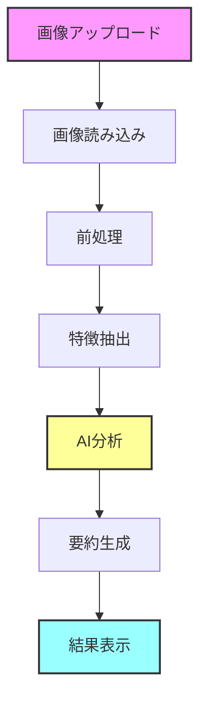

# 🔍 VisionForge - LangChain Image Analysis

## 📝 概要

VisionForgeは、LangChainのRunnableとGradioを組み合わせた画像分析アプリケーションです。画像の特徴を抽出し、AIによる詳細な分析と要約を提供します。

## ✨ 特徴

- 🖼️ 画像の基本的な特徴抽出（サイズ、輝度、コントラストなど）
- 🤖 LangChainを使用したAI分析
- 📊 段階的な処理と途中経過の表示
- 📝 詳細な分析結果と要約の提供
- 🔍 デバッグ情報の可視化（loguru）

## 🚀 セットアップ

1. 環境構築
```bash
# 仮想環境の作成と有効化
python -m venv .venv
.venv\Scripts\activate  # Windows
source .venv/bin/activate  # Linux/macOS

# 依存関係のインストール
pip install -r requirements.txt
```

2. 環境変数の設定
```bash
# .envファイルを作成し、必要な環境変数を設定
OPENAI_API_KEY=your_api_key_here
```

## 💻 使用方法

1. アプリケーションの起動
```bash
python app.py
```

2. ブラウザでアクセス
- ローカル: http://localhost:7860
- 共有リンク: 起動時に表示されるURLを使用

3. 画像のアップロード
- 画像をドラッグ＆ドロップまたはクリックしてアップロード
- サンプル画像を使用することも可能

## 📁 プロジェクト構造

```
VisionForge/
├── module/
│   ├── logger.py     # ロギング設定
│   ├── utils.py      # ユーティリティ関数
│   └── chain.py      # LangChainの実装
├── examples/         # サンプル画像
├── app.py           # メインアプリケーション
├── requirements.txt # 依存関係
└── README.md        # プロジェクト説明
```

## 🔄 処理フロー



## 🛠️ 主要コンポーネント

### 1. 画像処理 (utils.py)
- 画像の読み込みと形式変換
- 前処理（リサイズ、ノイズ除去）
- 結果のフォーマット

### 2. LangChain実装 (chain.py)
- RunnableLambdaによる特徴抽出
- RunnablePassthroughによるデータの受け渡し
- ChatGPTを使用した分析と要約

### 3. Gradioインターフェース (app.py)
- 直感的なユーザーインターフェース
- リアルタイムの進捗表示
- エラーハンドリング

## 📊 出力例

```json
{
  "基本情報": {
    "サイズ": "800x600",
    "形式": "RGB"
  },
  "画像特徴": {
    "輝度平均": 128.5,
    "コントラスト": 0.75
  },
  "分析結果": "画像は明るく、コントラストが適度...",
  "要約": "自然な色調で鮮明な画像..."
}
```

## 🤝 コントリビューション

1. このリポジトリをフォーク
2. 新しいブランチを作成 (`git checkout -b feature/amazing-feature`)
3. 変更をコミット (`git commit -m '新機能を追加'`)
4. ブランチをプッシュ (`git push origin feature/amazing-feature`)
5. プルリクエストを作成

## 📝 ライセンス

このプロジェクトはMITライセンスの下で公開されています。

---

<p align="center">
  Built with ❤️ using <a href="https://github.com/langchain-ai/langchain">LangChain</a> and <a href="https://github.com/gradio-app/gradio">Gradio</a>
</p>
