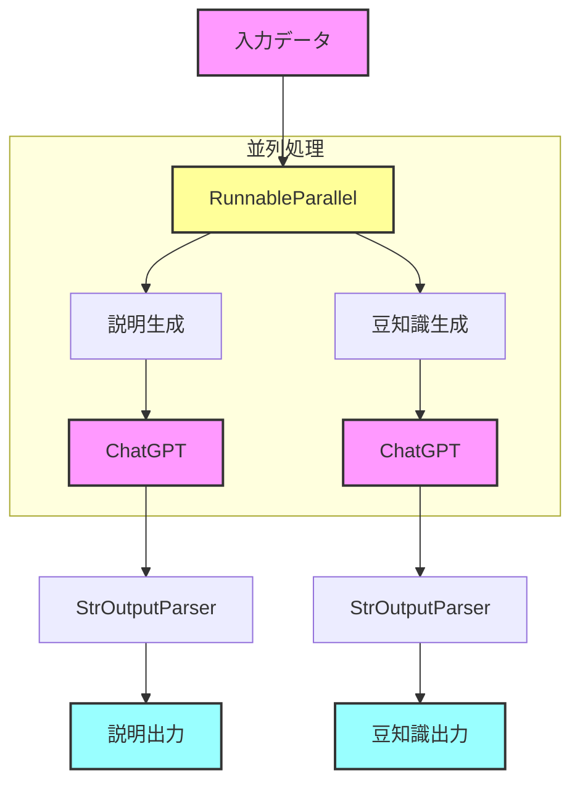
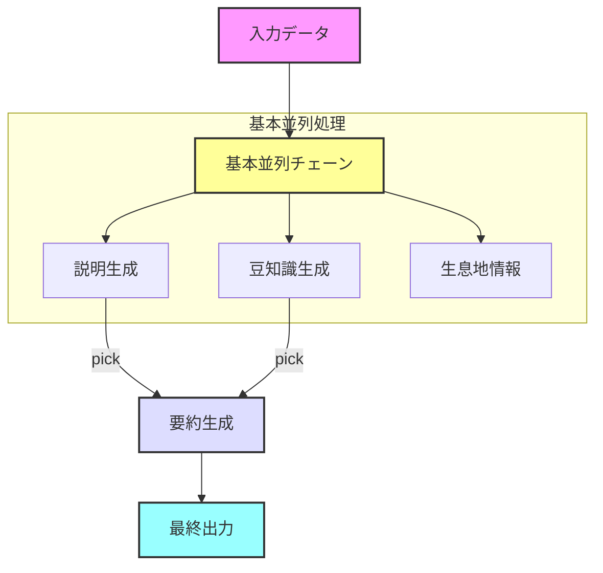

# 🚀 Langchain Advanced Runnable Tutorial

## 📝 概要

このディレクトリには、Langchainの高度なRunnable機能の実装例が含まれています。基本的なRunnableの知識を前提に、より複雑な並列処理とチェーンの組み合わせ方を学ぶことができます。

## 🎯 実装済みコンポーネント

### 1. 基本的な並列処理 (01_basic_parallel.py)
- RunnableParallelを使用した並列処理の基本
- デバッグ用コールバックの実装
- パフォーマンス計測機能

### 2. 拡張並列チェーン (02_enhanced_parallel_chains.py)
- 複数のLLMチェーンの並列実行
- 結果の選択的利用（pick機能）
- 複雑なチェーン構造の管理

## 🔄 処理フロー

### 基本的な並列処理のフロー



### 拡張並列チェーンのフロー



## 💡 実装のポイント

### デバッグコールバックの活用
```python
class DebugCallbackHandler(BaseCallbackHandler):
    def on_llm_start(self, serialized, prompts, **kwargs):
        # LLM開始時のデバッグ情報出力
        logger.debug(f"[Debug] LLM開始:\n{format_dict(formatted_prompts)}")
        
    def on_llm_end(self, response, **kwargs):
        # LLM終了時の結果出力
        logger.debug(f"[Debug] LLM終了:\n{format_dict(formatted_response)}")
```

### パフォーマンス計測
```python
@measure_execution_time
def execute_parallel_chain(chain, input_data):
    result = chain.invoke(input_data)
    return result
```

### 並列チェーンの構築
```python
chain = RunnableParallel(
    description=description_prompt | model | parser,
    fun_fact=fact_prompt | model | parser
)
```

## 🔍 重要な機能と概念

### 1. デバッグとモニタリング
- 詳細なログ出力
- 実行時間の計測
- エラーハンドリング

### 2. 並列処理の最適化
- 効率的なリソース利用
- 処理の依存関係管理
- 結果の集約と変換

### 3. チェーンの構造化
- モジュラー設計
- 再利用可能なコンポーネント
- 柔軟な拡張性

## 📊 使用例

各モジュールは以下のように実行できます：

```bash
# 基本的な並列処理の例
python 01_basic_parallel.py

# 拡張並列チェーンの例
python 02_enhanced_parallel_chains.py
```

## 🎓 学習のポイント

1. **並列処理の基礎**
   - RunnableParallelの使用方法
   - 並列処理のパターン

2. **デバッグとログ**
   - コールバックの実装
   - ログ出力の構造化

3. **パフォーマンス**
   - 実行時間の計測
   - 最適化のポイント

4. **エラーハンドリング**
   - 例外処理の実装
   - エラーのログ出力

## 🔧 設定と準備

1. 環境変数の設定
   ```
   OPENAI_API_KEY=your-api-key
   ```

2. 依存関係のインストール
   ```bash
   pip install -r requirements.txt
   ```

## ✨ 特徴

- 実践的なユースケース
- 詳細なログ出力
- パフォーマンス計測
- モジュラー設計
- 再利用可能なコンポーネント

## 📚 参考リソース

- [LangChain公式ドキュメント](https://python.langchain.com/docs/get_started/introduction)
- [OpenAI APIドキュメント](https://platform.openai.com/docs/introduction)

---

<p align="center">
  このチュートリアルは<a href="https://github.com/langchain-ai/langchain">LangChain</a>の高度なRunnableコンポーネントの使い方を学ぶために作成されました。
</p>
