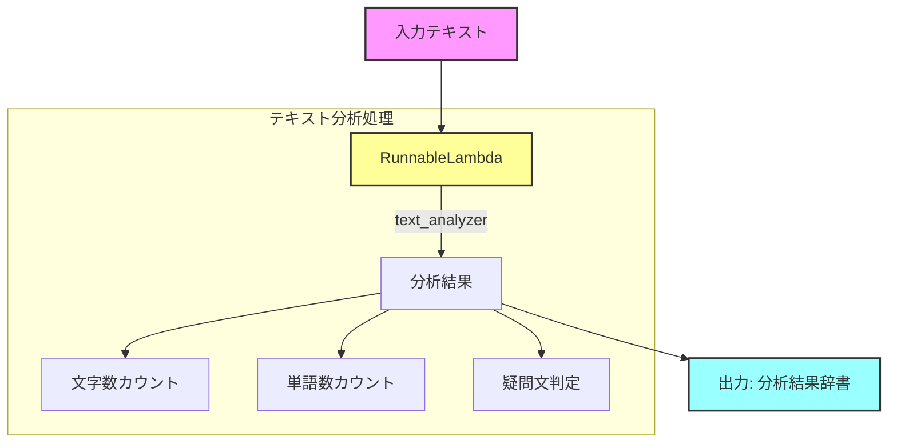
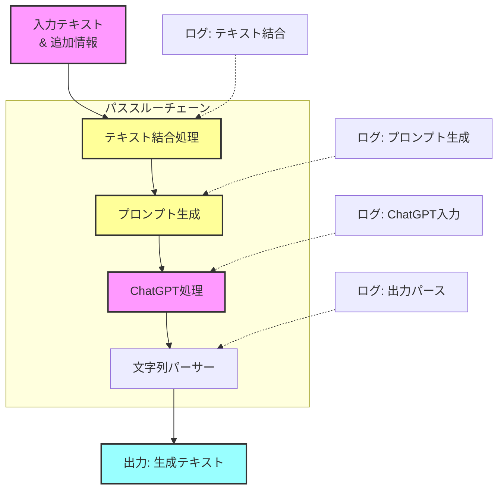
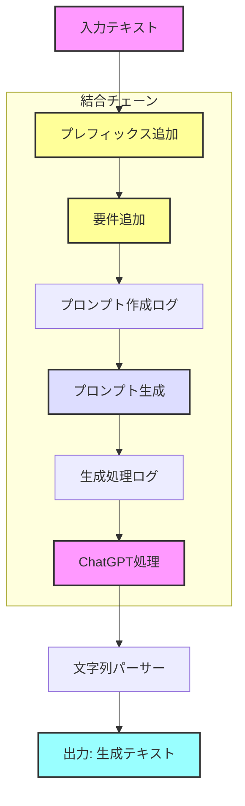
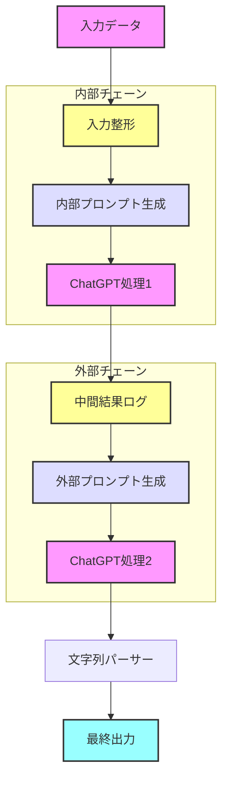
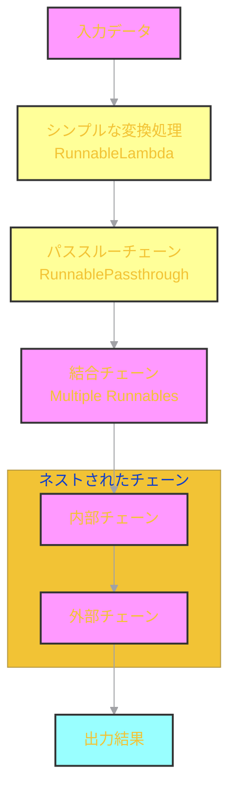

# 🔰 Langchain Basic Runnable Tutorial

## 📝 概要

このディレクトリには、Langchainの基本的なRunnableコンポーネントの使用例が含まれています。段階的に複雑さを増していく4つのサンプルを通じて、Runnableの基本的な概念と使い方を学ぶことができます。

## ⚡ 実装例と詳細ワークフロー

### 1. シンプルな変換処理 (01_simple_transform.py)
- 通常のPython関数をRunnableLambdaでラップ
- 基本的なテキスト分析の実装
- エラーハンドリングの基礎

#### ワークフロー図


### 2. パススルーチェーン (02_passthrough_chain.py)
- RunnablePassthroughを使用したデータの受け渡し
- 複数の処理のチェーン化
- ログ出力による処理の可視化

#### ワークフロー図


### 3. 結合チェーン (03_combined_chain.py)
- 複数のRunnableの組み合わせ
- 段階的な処理の実装
- 処理フローの制御

#### ワークフロー図


### 4. ネストされたチェーン (04_nested_chain.py)
- 入れ子構造を持つ複雑なチェーンの実装
- 中間結果の活用
- エラーハンドリングの応用

#### ワークフロー図


## 🔄 全体の処理フロー

以下は、4つのコンポーネントがどのように連携するかを示す全体図です：



## 💡 実装のポイント

### シンプルな変換処理
```python
def text_analyzer(text: str) -> Dict[str, Any]:
    return {
        "original_text": text,
        "character_count": len(text),
        "word_count": len(text.split()),
        "is_question": "?" in text
    }

transform = RunnableLambda(text_analyzer)
```

### パススルーチェーン
```python
chain = (
    RunnableLambda(add_context)
    | prompt
    | ChatOpenAI()
    | StrOutputParser()
)
```

### 結合チェーン
```python
chain = (
    RunnableLambda(add_prefix)
    | RunnableLambda(add_requirements)
    | prompt
    | ChatOpenAI()
    | StrOutputParser()
)
```

### ネストされたチェーン
```python
inner_chain = RunnableLambda(format_input) | inner_prompt
outer_chain = outer_prompt | ChatOpenAI()
```

## 📊 使用例

各モジュールは個別に実行可能です：

```bash
# シンプルな変換の例
python 01_simple_transform.py

# パススルーチェーンの例
python 02_passthrough_chain.py

# 結合チェーンの例
python 03_combined_chain.py

# ネストされたチェーンの例
python 04_nested_chain.py
```

## ✨ 特徴

- 段階的な学習が可能な構成
- 実践的なユースケースの実装
- 詳細なログ出力による処理の可視化
- エラーハンドリングのベストプラクティス
- 再利用可能なコンポーネント設計

## 🎨 色分けの説明

各ワークフロー図で使用されている色の意味：
- 🟣 入力/出力 (紫/青)
- 🟡 データ変換処理 (黄)
- 🔵 プロンプト関連 (青)
- 🟣 ChatGPT処理 (紫)

## 🔍 詳細説明

各実装例の詳細な説明とソースコードのコメントを参照してください：

- [シンプルな変換処理の説明](01_simple_transform.py)
- [パススルーチェーンの説明](02_passthrough_chain.py)
- [結合チェーンの説明](03_combined_chain.py)
- [ネストされたチェーンの説明](04_nested_chain.py)

---

<p align="center">
  このチュートリアルは<a href="https://github.com/langchain-ai/langchain">LangChain</a>のRunnableコンポーネントの基本的な使い方を学ぶために作成されました。
</p>
